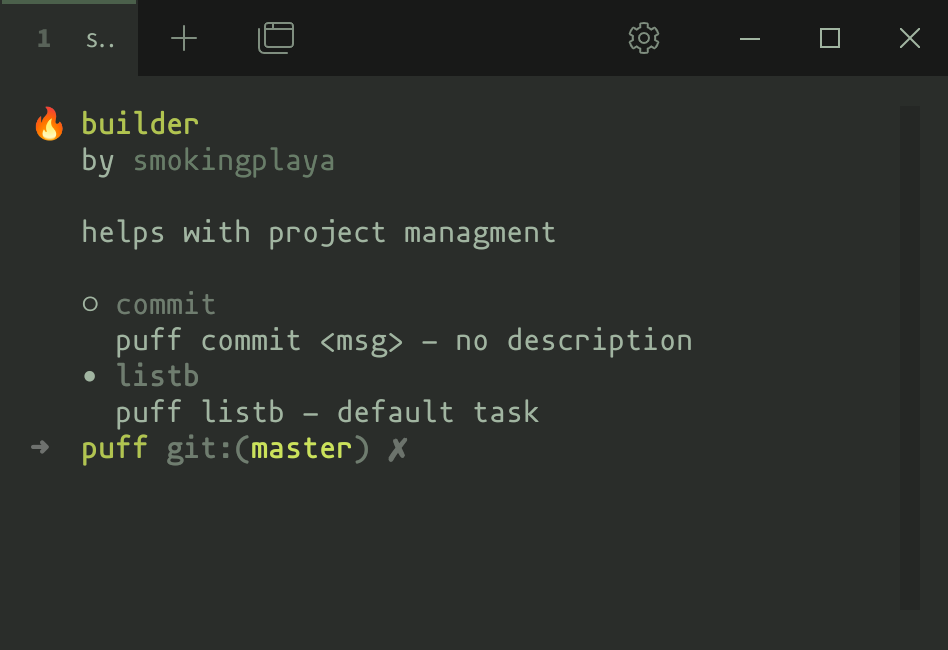

<h1 align="center">
  

  Puff
</h1>

<h3 align="center">The puffiest CLI tool</h3>

<div align="center">
  
  
  
  
  
</div>

Puff is a CLI tool that allows you to write predefined sets of commands using YAML.

Puff is similar to [GNU/Make](https://www.gnu.org/software/make/).

> [!NOTE]
> You can just look at [Example](#example), and you'll probably understand the idea, and how to use Puff.

# Table of contents
* [Installation](#installation)
  * [Linux](#linux)
  * [Windows](#windows)
* [Usage](#usage)
  * [Example](#example)
  * [Puff File](#puff-file)
  * [Tasks](#tasks)
  * [Puff File Data](#data)
  * [Arguments](#arguments)
  * [Variables](#variables)
  * [Configuration](#configuration)
  * [Multi Thread commands](#multi-thread-commands)
  * [Built-in commands](#built-in-commands)
* [Building](#building)
* [Contribution](#contribution)

# Installation
## Linux
1. Open terminal
2. Paste command
```bash
/bin/sh -c "$(curl -fsSL https://raw.githubusercontent.com/smokingplaya/puff/HEAD/install/linux.sh)"
```

## Windows
1. Open powershell **with admin rights**
2. Paste command
```bash
& {Invoke-WebRequest -Uri "https://raw.githubusercontent.com/smokingplaya/puff/install/windows.ps1" -OutFile "$env:USERPROFILE\Downloads\puffinstaller.ps1"; & "$env:USERPROFILE\Downloads\puffinstaller.ps1"}
```

# Usage
> [!NOTE]
> Workspace = Current Working Directory



## Example
```yml
data: # optional
  authors: ["smokingplaya"]
  description: Test Puff File
  projectName: Builder

variables:
  imageName: big_bob

tasks:
  default: # $ puff
    description: Just default Task # optional
    commands:
      - echo
  build:
    description: Build project and deploy it
    commands:
      - docker build -t ${imageName} .
      - docker-compose down
      - docker-compose up -d
```

## Puff File
Puff File is the configuration file of the current workspace.\
This means that each workspace should have its own Puff File with tasks defined in it.

Puff File can have 3 different names - ``puff.yaml``, ``puff.yml``, ``.puff``, but ``puff.yaml`` is preferred.

Let's learn more about its structure!

## Tasks
``tasks`` is the main parameter of the Puff File.
It describes all commands to be executed by a particular Task.
It's not very clear so far, is it? Let's take a look at an example:
```yml
tasks:
  default:
    commands:
      - echo Hello, world!
```
So, this example shows the description of Task ``default``, which when executed will print “Hello, world!” to our console

How to execute the ``default`` task? Just use
```bash
puff
# or
puff default
```
> [!NOTE]
> You can change default task.\
> See [Configuration](#configuration).

As you can see, the default task that is executed when there are no arguments is ``default``.

## Data
> [!NOTE]
> This parameter is only needed in ``puff list``.

The ``data`` parameter is optional. It contains data about the current Puff File that describes:
1. Project name
2. authors
3. Description of the current Puff File

Example:
```yml
data:
  projectName: Example
  authors: ["smokingplaya"]
  description: Puff File example
```

## Arguments
Sometimes we need to add some arguments to commands that are not constant and need user input. For this purpose, Puff has a built-in command formatter that substitutes arguments for commands.

There are three types of arguments:
1. Those entered from the command line
    * In this case, you must describe these arguments for each Task.
    ```yml
    tasks:
      default:
        arguments:
          - name: home
          - name: save_path
            default: /home/drippy/cheese
        commands:
          - echo "${home} -> ${save_path}"
    ```
2. Constants (``variables`` parameter)
    * See [Variables](#variables)
3. Environment variables
    * Just look at example:
    ```yml
    tasks:
      default:
        commands:
          - echo ${JAVA_HOME}
    ```


## Variables
The ``variables`` parameter describes “constants” that you can use in commands as arguments.

Example:
```yml
variables:
  bestGame: minecraft

tasks:
  default:
    commands:
      - echo "I love ${bestGame}"
```

## Configuration
The ``configuration`` field is needed to reassign internal values such as ``shell`` and ``task``.

Example:
```yml
configuration:
  shell: bash
  task: run

tasks:
  # $ puff
  # will be run "run" task
  run:
    commands: []
```

## Shell
``shell`` is the parameter responsible for the environment in which tasks will be run.
By default, all tasks are started in the same shell in which you started Puff.

For example, you can specify ``powershell``, ``cmd`` (windows), ``bash``, ``zsh``, ``fish``.

## Task
``shell`` is the parameter responsible for which task will be started when there is no task (i.e. by default).
Value by default: ``default``

## Multi Thread commands
Puff supports executing commands in a multithreaded fashion.\
This allows you to execute commands independently of each other, thus reducing the time required to complete a task.

### Usage
```yml
- thread: Command
```

Example:
```yml
tasks:
  default:
    commands:
      # regular command
      - echo
      # multi threaded commands
      - thread: gcc projects/soundsystem/main.cpp -o build/soundsystem.o
      - thread: gcc projects/ui/main.cpp -o build/ui.o
      - thread: gcc projects/windowhandler/main.cpp -o build/windowhandler.o
```


## Built-in commands
### List
Usage
```bash
puff list
```
Displays all commands defined in the current Puff File, also showing which commands have which arguments, and what values the default arguments have.

### Help
Usage
```bash
puff help
```
Displays all commands, build-in in Puff

# Building
1. Install [Rust Lang](https://rust-lang.org)
2. Open your terminal and paste this
```bash
git https://github.com/smokingplaya/puff
cd puff
# In debug mode
cargo build
# In release mode
cargo build --release
```

Then you can run builded [Puff](https://github.com/smokingplaya/puff)
```bash
# Manually in debug mode
./target/debug/puff #(puff.exe on windows)
# Manually in release mode
./target/release/puff #(puff.exe on windows)

# Via cargo
cargo run
```

# Contribution
We always welcome good pull requests that take place, as well as those that fix/add some functionality.

We don't have a specific code style, or other rules for writing code, we just look at your changes and if we like them we accept them.